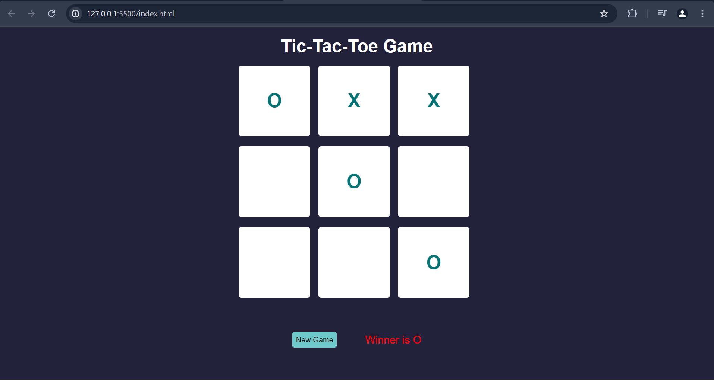

# Tic Tac Toe

I just build it for fun. Give yourself a break and try it once 🤗🌟

You can play the game online at (https://take-a-break-play-game.netlify.app/).

## Features

- Classic 3x3 Tic Tac Toe grid
- Easy to play: just click to place your mark
- Interactive and responsive design

## How to Play

1. Open the `index.html` file in your web browser.
2. Choose your marker (X or O) and take turns with your opponent.
3. The first player to align three of their marks horizontally, vertically, or diagonally wins the game.

## Screenshot

## Installation

1. Clone the repository or download the ZIP file.
2. Extract the files to your desired location.
3. Open the `index.html` file in your web browser to start playing.

## Technologies Used

- HTML
- CSS
- JavaScript

## License

This project is open source and available under the MIT License.
